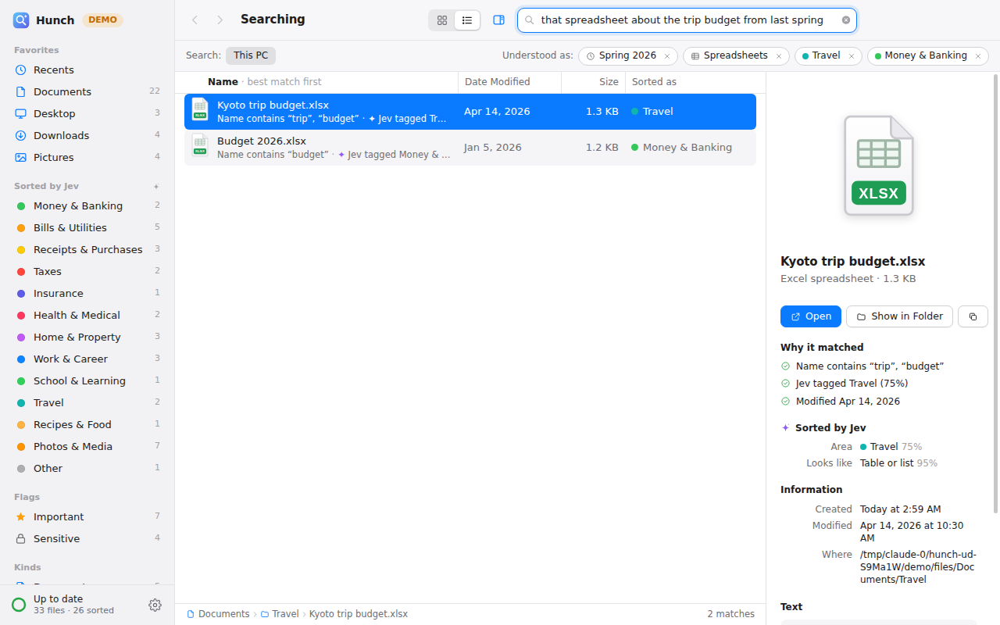
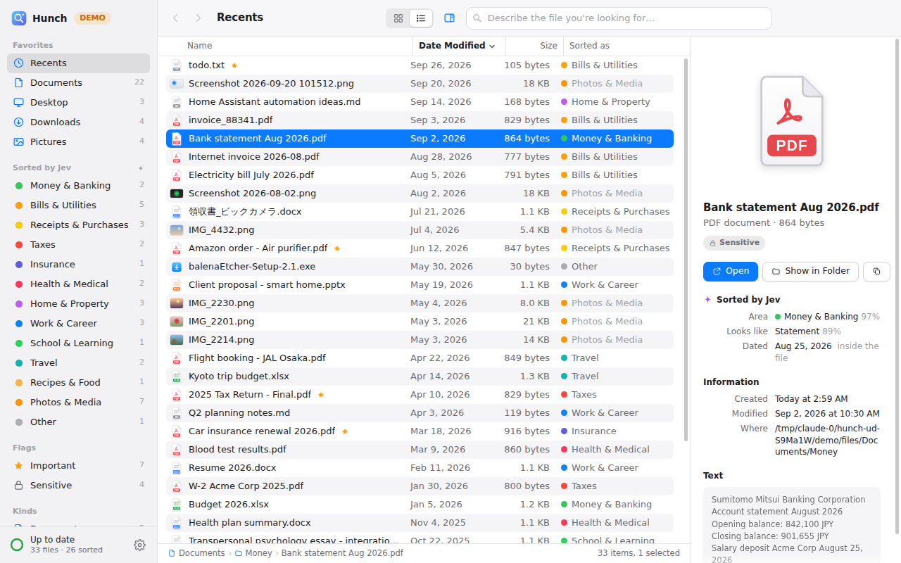
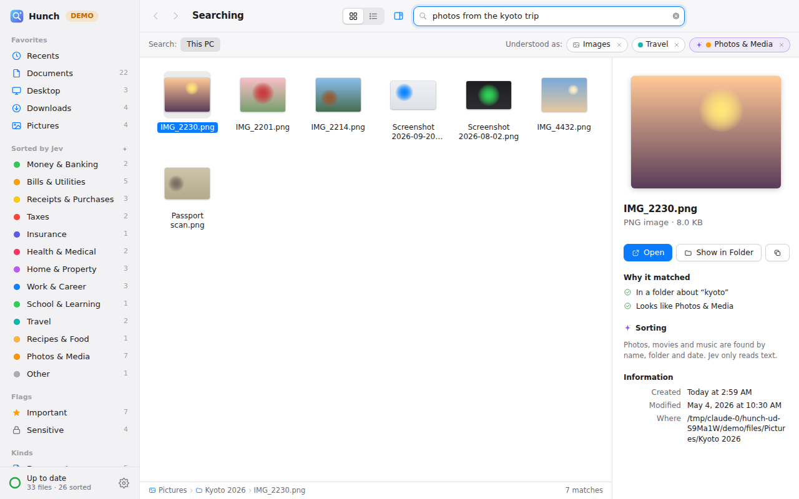
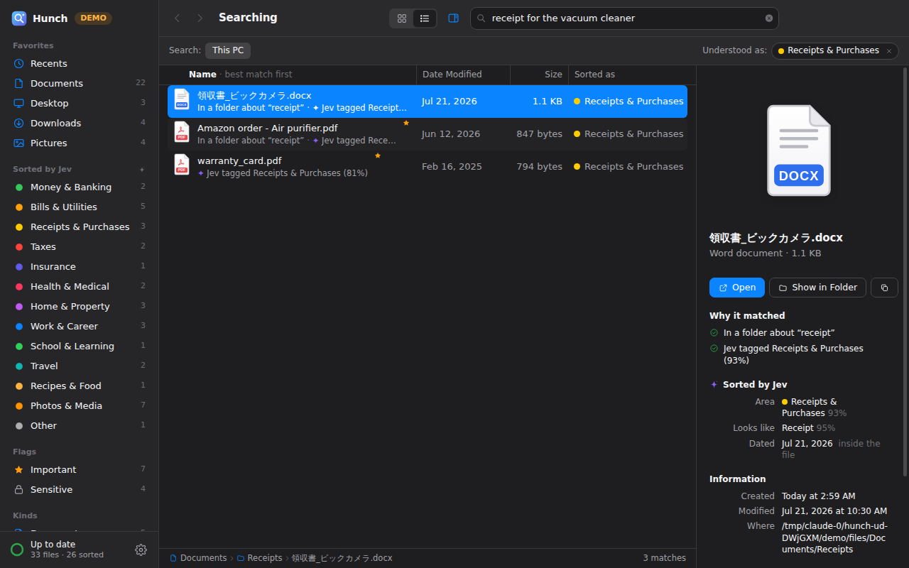

# Hunch

**Find files on your PC by describing them the way you remember them.**

Type *"that spreadsheet about the trip budget from last spring"* and Hunch finds `Kyoto trip budget.xlsx`. It looks and feels like the Mac Finder, and it runs on Windows (and macOS).



## How it works

1. **Indexing.** Hunch walks the folders you choose (Documents, Desktop, Downloads and Pictures by default). It reads the text inside Word, Excel, PowerPoint, PDF, text and email files, then keeps watching for new and changed files.
2. **Sorting with Jev.** [Jev](https://github.com/kraayenjon/awesome-jev) is TypeSafe's decision model, served through OpenRouter. It files every document under an area of life (Money, Bills, Taxes, Insurance, Health, Travel and so on) and a document type (receipt, contract, ticket and so on). It also picks out the document's own date, and flags files that look important or sensitive.
3. **Understanding your search.** Dates ("last spring", "a few months ago", "around Christmas") and kinds ("spreadsheet", "screenshot") are understood on your PC, instantly. Jev then reads the whole sentence to guess which area of life you mean. Each part of that interpretation appears as a chip you can remove with one click.
4. **Similar meaning (optional).** With an OpenAI key, Hunch also finds files that mean the same thing when no words match, for example "auto policy" for "car insurance".

Each result says why it matched, for example: *Name contains "budget" · Jev tagged Travel · Modified Apr 14, 2026*.

| Browse by what files are about | Icon view with thumbnails | Dark mode |
|---|---|---|
|  |  |  |

## Install on Windows

### Option A: download the installer

1. On GitHub, open this repository's **Actions** tab and choose **Build Hunch for Windows**.
2. Open the most recent green run and scroll down to **Artifacts**.
3. Download **Hunch-Windows-installer** and unzip it.
4. Double-click `Hunch-Setup-0.1.0.exe`.
5. Windows may say *"Windows protected your PC"*, because the installer isn't code-signed. Click **More info**, then **Run anyway**.

### Option B: build it yourself

1. Install [Node.js 22 LTS](https://nodejs.org/).
2. Open a terminal in this `hunch` folder and run:
   ```
   npm install
   npm start
   ```
3. To make an installer: `npm run dist`. It lands in `hunch/dist/`.

## Connect Jev (recommended)

1. Go to [openrouter.ai](https://openrouter.ai), sign in, and open **Keys**, then **Create key**.
2. Add a little credit. $5 is plenty: sorting 1,000 files costs roughly 20 cents at Jev's September 2026 price.
3. Paste the key into Hunch, either on the welcome screen or in **Settings › AI**.

To add similar-meaning search, paste an [OpenAI API key](https://platform.openai.com/api-keys) in **Settings › AI**. It uses `text-embedding-3-small`, which costs pennies for thousands of files.

Without any keys, Hunch still works: it searches names, folders, dates and the text inside documents on your PC, and makes a local keyword guess at each file's area of life.

## Try it without your own files

Choose **Try the demo first** on the welcome screen, or run `npm run demo`. Demo mode creates 33 realistic sample files (tax forms, a lease, receipts in English and Japanese, trip photos and so on). It uses an offline stand-in for Jev, so you can explore without a key. The stand-in only matches words; the real Jev reads meaning.

## Privacy

- **The index stays on your PC.** File contents are never uploaded anywhere.
- **What Jev receives:** each document's name, folder, modified date and up to 5,000 characters of its text. Emails, phone numbers, card and account numbers, ID numbers and passwords are masked before sending. Your search sentences are sent too, so Jev can interpret them.
- **Names-only mode** sends just file names and folders.
- **Private folders** (a toggle per folder in **Settings › Folders**) are searchable but never sent to any AI service.
- **Never sent:** photos, movies, music and the files themselves.
- **Cloud folders:** OneDrive, Dropbox and Google Drive files are not opened by default, because opening an online-only file makes Windows download it. They are still found by name, folder and date.
- **API keys** are encrypted with your Windows account (DPAPI, via Electron `safeStorage`).

## Keyboard

| Keys | Action |
|---|---|
| Ctrl+F | Search |
| ↑ ↓ | Move selection |
| Enter | Open file |
| Space | Quick Look |
| Ctrl+1 / Ctrl+2 | Icon or list view |
| Alt+← / Alt+→ | Back / forward |
| Ctrl+C | Copy path |
| Ctrl+, | Settings |

Right-click a file for more options, or drag it straight into another app.

## Limits

- Scanned PDFs and photos have no readable text, so they are found by name, folder, date and tags only. OCR could be added later.
- Jev launched on September 15, 2026. Its API is in OpenRouter's alpha, so prices and details may change.
- The index is a single JSON file in `%APPDATA%\Hunch`. It suits personal collections of up to a few hundred thousand files.

## For developers

```
npm test        # core tests: date parsing, extraction, ranking, privacy, persistence
npm run demo    # the app with sample files and the offline Jev stand-in
```

- `src/core/` holds the engine: indexing, text extraction, the Jev client, embeddings and search. It has no Electron dependency.
- `src/main/` is the Electron main process and preload bridge.
- `src/renderer/` is the Finder-style UI, written in plain HTML, CSS and JavaScript.

The Jev request format (a `state` plus named `choice` and `noul` questions, posted to OpenRouter's `/api/alpha/decisions`) follows [nexibeo/jev-organize](https://github.com/nexibeo/jev-organize).
